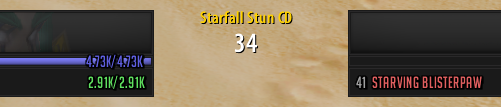

# StarfallStunTimer
A simple timer for tracking [Vanilla+'s](https://www.vanillaplus.org/) Starfall Stun cooldown as a Druid. The timer function itself is fetched from [Wayborn's example addon](https://github.com/GoodOldWow/TestAddon1). Go give them a star for their great work!

## Installation instructions
1. Press the green "code" button -> Download ZIP
2. Extract StarfallStunTimer-main from inside StarfallStunTimer-main.zip and rename the folder StarfallStunTimer. Then place into your client's AddOns folder. The folder structure should look something like this:
```
wowfolder\
└── Interface\
    └── AddOns\
        └── StarfallStunTimer\
            ├── StarfallStunTimer.toc
            └── StarfallStunTimer.lua
```
